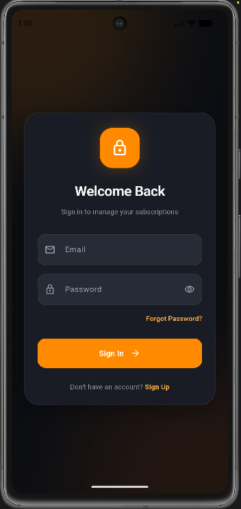
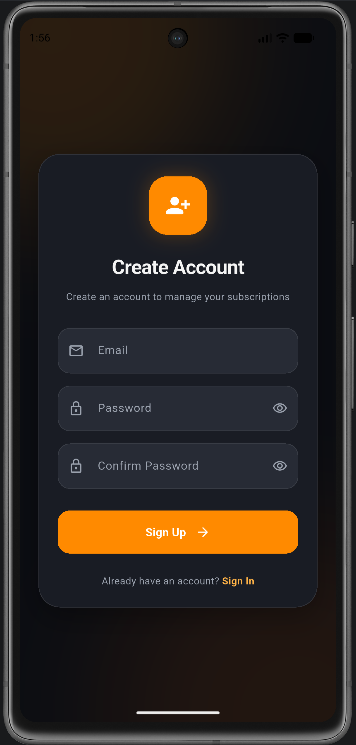
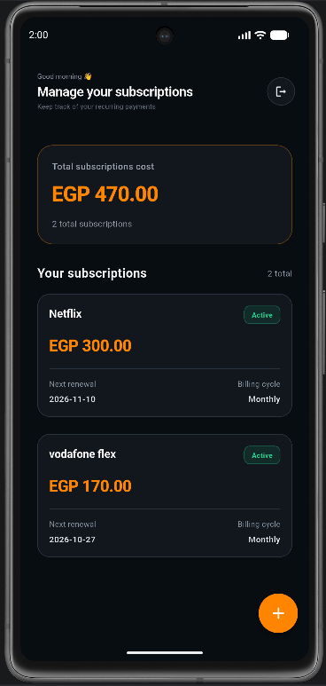
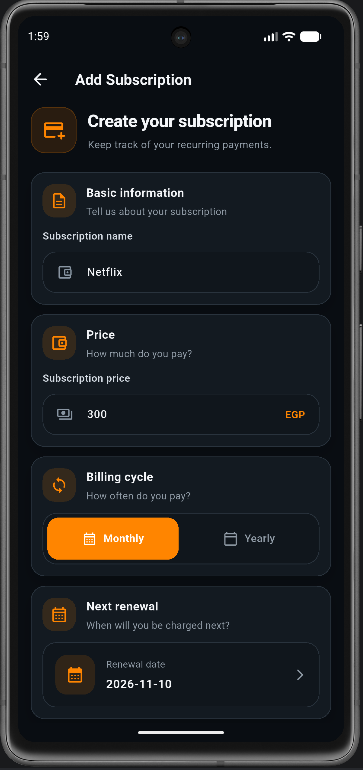
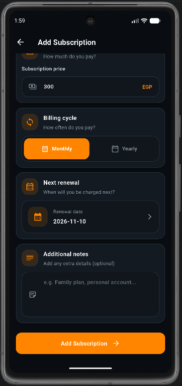
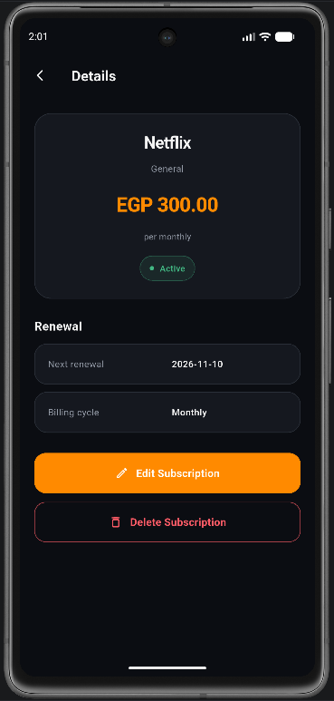
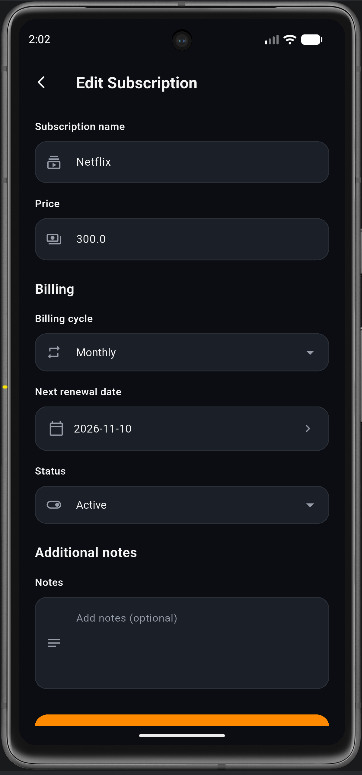

# My Subscriptions 📱

A Flutter application for managing personal subscriptions in one place.

The application is designed to help users organize their subscriptions, track renewal dates, and
manage subscription information through a clean and structured interface.

## ✨ Features

- User authentication with Firebase Authentication.
- Add a new subscription.
- View all saved subscriptions.
- View subscription details.
- Edit subscription information.
- Delete subscriptions with confirmation.
- Track subscription price and billing cycle.
- Track the next renewal date.
- Organize subscriptions by category.
- Add optional notes to subscriptions.
- Support for active and cancelled subscription statuses.
- Local storage support using Hive CE.
- Feature-based project organization.

## 📸 Screenshots

### 🔐 Authentication

<table>
  <tr>
    <th>Login</th>
    <th>Register</th>
  </tr>
  <tr>
    <td align="center">
      
    </td>
    <td align="center">
      
    </td>
  </tr>
</table>

### 📱 Subscriptions

<table>
  <tr>
    <th>Home</th>
    <th>Add Subscription</th>
  </tr>
  <tr>
    <td align="center" valign="top">
      
    </td>
    <td align="center" valign="top">
      
      
    </td>
  </tr>
</table>

### 📄 Subscription Details

<table>
  <tr>
    <th>Details</th>
    <th>Edit Subscription</th>
  </tr>
  <tr>
    <td align="center">
      
    </td>
    <td align="center">
      
    </td>
  </tr>
</table>

## 🛠️ Technologies Used

- **Flutter**
- **Dart**
- **Firebase Authentication**
- **Hive CE**
- **flutter_bloc / Cubit**
- **GetIt**
- **Injectable**
- **Build Runner**
- **Clean Architecture principles**
- **Feature-First structure**

## 🏗️ Architecture

The project follows a Feature-First structure with separated responsibilities.

Main technologies and responsibilities:

- **Presentation:** Screens, widgets, and Cubits.
- **Data:** Models, repositories, and data sources.
- **Remote Data Source:** Firebase-related operations.
- **Local Data Source:** Hive CE storage operations.
- **Dependency Injection:** GetIt and Injectable.
- **State Management:** Cubit using `flutter_bloc`.

## 📂 Project Structure

A simplified structure of the project:

```text
lib/
├── core/
│   └── ...
├── features/
│   ├── auth/
│   │   ├── core/
│   │   │   └── di/
│   │   ├── data/
│   │   │   ├── data_source/
│   │   │   ├── model/
│   │   │   └── repo/
│   │   └── presentation/
│   │       ├── cubit/
│   │       ├── pages/
│   │       └── widgets/
│   │
│   └── subscriptions/
│       ├── core/
│       │   └── di/
│       ├── data/
│       │   ├── data_source/
│       │   │   ├── local/
│       │   │   └── remote/
│       │   ├── model/
│       │   └── repo/
│       └── presentation/
│           ├── cubit/
│           ├── pages/
│           └── widgets/
│
└── main.dart
```

> The exact structure may evolve as the project is improved and refactored.

## 🔐 Authentication

The authentication system uses Firebase Authentication.

The project includes:

- Sign in.
- Sign up.
- Logout.
- Authentication status checking.
- Password reset flow.
- Navigation based on authentication state.

## 📦 Subscription Data

A subscription contains information such as:

- `id`
- `name`
- `price`
- `billingCycle`
- `nextRenewalDate`
- `category`
- `notes`
- `status`
- `userId`

### Billing Cycle

Supported billing cycles include:

- Monthly
- Yearly

### Subscription Status

Supported statuses include:

- Active
- Cancelled

## 🚀 Getting Started

### 1. Clone the Project

```bash
git clone <your-repository-url>
```

Move into the project directory:

```bash
cd my_subscriptions
```

### 2. Install Dependencies

```bash
flutter pub get
```

### 3. Configure Firebase

Configure Firebase for your Flutter application using the official Firebase setup process.

Make sure the required Firebase configuration files are added for the target platforms.

### 4. Generate Required Files

If the project uses Injectable or Hive CE generated files, run:

```bash
dart run build_runner build --delete-conflicting-outputs
```

### 5. Run the Application

```bash
flutter run
```

## 🧪 Code Analysis

To analyze the project, run:

```bash
flutter analyze
```

You can also run:

```bash
dart analyze
```

Before creating a pull request or committing major changes, review the analyzer output and resolve
relevant issues.

## 🧰 Development Guidelines

- Keep business logic outside UI widgets.
- Use Cubit for state management.
- Keep repositories responsible for data operations.
- Separate local and remote data sources.
- Avoid placing large amounts of code inside a single page.
- Extract reusable widgets into dedicated widget files.
- Do not modify generated files manually.
- Run code generation after changing Injectable or Hive annotations.
- Test authentication and subscription flows after major changes.
- Keep UI improvements separate from business logic changes whenever possible.

## 🗺️ Planned Improvements

Possible future improvements include:

- Better subscription reminders.
- Notifications before renewal dates.
- More filtering and sorting options.
- Improved subscription analytics.
- Better category management.
- More customization options.
- Additional local-storage and Firebase synchronization improvements.

## 📌 Project Status

The project is currently under development.

The authentication flow, subscription screens, state management, dependency injection, and storage
structure are being developed and reviewed incrementally.

## 👨‍💻 Author

**Ahmed Abbas**

Computer Science Student  
Flutter Developer

---

## 📄 License

This project is currently for learning and development purposes.

Add a suitable license here if the project is published publicly.
